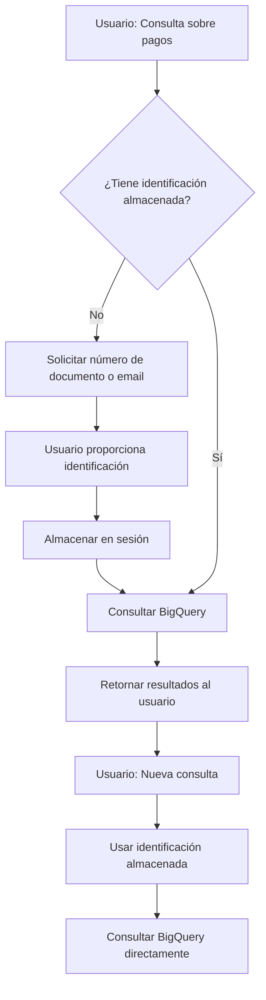

# Education Assistant Agent - ESIC Corporate

Agente de inteligencia artificial desarrollado con **Google Agent Development Kit (ADK)** para el Servicio de Atención al Cliente (SAC) de ESIC Corporate. Este agente proporciona atención automatizada a estudiantes y aspirantes de programas de Máster y formación ejecutiva.

## Descripción

El Education Assistant es un asistente virtual conversacional que combina:

- **Búsqueda web inteligente** para información pública de ESIC (programas académicos, admisiones, precios)
- **Acceso a datos personalizados** de estudiantes mediante BigQuery (matrículas, pagos, calificaciones)
- **Gestión de sesiones** que mantiene la identificación del estudiante durante toda la conversación
- **Generación de certificaciones** automáticas

## Características Principales

### 1. Gestión Inteligente de Identificación
El sistema incluye un módulo avanzado de gestión de sesiones que:
- Solicita la identificación del estudiante (documento o email) solo una vez
- Mantiene la sesión activa durante toda la conversación
- Evita consultas repetitivas mejorando la experiencia del usuario

Documentación detallada: [STUDENT_IDENTIFICATION.md](./STUDENT_IDENTIFICATION.md)

### 2. Consultas a BigQuery
Acceso seguro a información personalizada del estudiante:
- **Información general**: Datos personales, programas matriculados, contacto
- **Estado de pagos**: Historial de transacciones, pendientes, vencimientos
- **Estado de matrícula**: Programas activos, fechas de inicio/fin, estado
- **Calificaciones académicas**: Notas por curso, promedios, créditos aprobados

### 3. Búsqueda Web Especializada
Dos herramientas de búsqueda optimizadas:
- `search_esic_information`: Prioriza sitios oficiales de ESIC (esic.edu, esic.co)
- `search_web`: Búsqueda web general para contexto adicional

### 4. Generación de Certificaciones
Genera certificados académicos en formato HTML con:
- Información del estudiante
- Datos del programa académico
- Formato profesional y estructurado

## Arquitectura del Proyecto

```
my-agent-education/
├── sac_agent/                    # Agente principal
│   ├── agent.py                  # Definición del agente raíz
│   ├── prompt.py                 # Instrucciones y personalidad del agente
│   ├── session_manager.py        # Gestión de sesiones de estudiantes
│   ├── tools/                    # Herramientas del agente
│   │   ├── bigquery_tools.py     # Consultas a BigQuery
│   │   ├── student_identification.py  # Gestión de identificación
│   │   └── certification_tools.py     # Generación de certificados
│   └── sub_agents/               # Sub-agentes especializados
│       └── web_search_agent.py   # Búsqueda web
├── data/                         # Datos de ejemplo y scripts de carga
│   ├── student_info.csv
│   ├── payments.csv
│   ├── enrollment.csv
│   ├── grades.csv
│   ├── load_data_to_bigquery.py
│   └── verify_data.py
├── test_agent/                   # Agente de pruebas
├── .env                          # Configuración (no versionado)
├── .gitignore
├── STUDENT_IDENTIFICATION.md     # Documentación del sistema de sesiones
└── README.md                     # Este archivo
```

## Requisitos Previos

- Python 3.10 - 3.13
- [Poetry](https://python-poetry.org/) para gestión de dependencias
- Cuenta de Google Cloud Platform con:
  - Vertex AI API habilitada
  - BigQuery API habilitada
  - Credenciales configuradas
- Google ADK instalado (`google-adk~=0.1.0`)

## Instalación

### 1. Clonar el Repositorio

```bash
cd <PATH>/my-agent-education
```

### 2. Configurar Variables de Entorno

Crea un archivo `.env` en la raíz del proyecto:

```bash
# Google Cloud Configuration
GOOGLE_GENAI_USE_VERTEXAI=TRUE
GOOGLE_CLOUD_PROJECT=your-gcp-project-id
GOOGLE_CLOUD_LOCATION=your-location

# BigQuery Configuration
BQ_PROJECT_ID=your-gcp-project-id
BQ_DATASET_ID=students
BQ_STUDENTS_TABLE=student_info
BQ_PAYMENTS_TABLE=payments
BQ_ENROLLMENT_TABLE=enrollment
BQ_GRADES_TABLE=grades
```

### 3. Configurar Credenciales de Google Cloud

```bash
# Opción 1: Usar Application Default Credentials
gcloud auth application-default login

# Opción 2: Usar Service Account
export GOOGLE_APPLICATION_CREDENTIALS="/path/to/service-account-key.json"
```

### 4. Instalar Dependencias

```bash
poetry install
```

### 5. Cargar Datos de Ejemplo a BigQuery

```bash
# Cargar los datos CSV a BigQuery
python data/load_data_to_bigquery.py

# Verificar que los datos se cargaron correctamente
python data/verify_data.py
```

## Uso

### Ejecutar en Modo CLI

```bash
adk run .
```

Interactúa con el agente a través de la línea de comandos:

```
Usuario: Hola, quiero saber el estado de mis pagos
Agente: Por favor, proporciona tu número de documento o correo electrónico registrado
Usuario: 1234567890
Agente: [Consulta y muestra el historial de pagos]
Usuario: Y mis calificaciones?
Agente: [Consulta directamente sin pedir identificación de nuevo]
```

### Ejecutar en Modo Web UI

```bash
adk web
```

Abre tu navegador en `http://localhost:8000` para interactuar con el agente a través de una interfaz web.

### Desplegar en Vertex AI Agent Engine

```bash
# Crear script de deployment
python deployment/deploy.py
```

## Herramientas Disponibles

### Identificación del Estudiante
- `check_has_student_identifier()`: Verifica si existe identificación almacenada
- `set_student_identifier(identifier)`: Almacena la identificación del estudiante
- `get_stored_student_identifier()`: Recupera la identificación almacenada
- `clear_student_identifier()`: Limpia la sesión (cambio de estudiante)

### Consultas BigQuery
- `get_student_info()`: Información general del estudiante
- `get_payment_status()`: Historial de pagos y pendientes
- `get_enrollment_status()`: Estado de matrícula activa
- `get_academic_grades()`: Calificaciones y promedio académico

### Búsqueda Web
- `search_esic_information(query)`: Búsqueda en sitios oficiales de ESIC
- `search_web(query)`: Búsqueda web general

### Generación de Documentos
- `generate_certification()`: Genera certificado académico en HTML

## Flujo de Trabajo Típico



## Personalidad del Agente

El asistente está configurado con las siguientes características:

- **Rol**: Asistente Virtual de ESIC Corporate
- **Tono**: Profesional pero cercano, servicial y eficiente
- **Idioma**: Español
- **Objetivo**: Primer punto de contacto para resolver dudas y gestionar solicitudes

## Datos de Ejemplo

El directorio `data/` contiene archivos CSV de ejemplo:

- `student_info.csv`: 20 estudiantes de ejemplo
- `payments.csv`: Historial de pagos
- `enrollment.csv`: Matrículas activas
- `grades.csv`: Calificaciones académicas

## Testing

### Ejecutar Tests

```bash
pytest tests/ -v
```

### Casos de Prueba Recomendados

1. Solicitar información sin proporcionar identificación primero
2. Proporcionar identificación y hacer múltiples consultas
3. Cambiar de estudiante usando `clear_student_identifier`
4. Probar con email vs número de documento
5. Verificar consultas BigQuery con identificador correcto

## Tecnologías Utilizadas

- **Framework**: Google Agent Development Kit (ADK) v0.1.0
- **LLM**: Google Gemini 2.0 Flash (via Vertex AI)
- **Base de Datos**: Google BigQuery
- **Búsqueda Web**: SerpAPI (Google Search integration)
- **Lenguaje**: Python 3.10+
- **Gestión de Dependencias**: Poetry

## Configuración del Modelo

El agente utiliza:
- **Modelo**: `gemini-2.0-flash`
- **Capacidades**: Razonamiento dinámico, función calling, streaming
- **Integración**: LangChain + Vertex AI

## Estructura de Datos BigQuery

### Tabla: student_info
```sql
student_id, first_name, last_name, email, phone, id_number, enrollment_date, status
```

### Tabla: payments
```sql
payment_id, student_id, amount, payment_date, due_date, status, payment_method, concept
```

### Tabla: enrollment
```sql
enrollment_id, student_id, program_code, program_name, start_date, end_date, status
```

### Tabla: grades
```sql
grade_id, student_id, course_code, course_name, period, credits, grade, status
```

## Limitaciones Conocidas

- Las sesiones son en memoria (se pierden al reiniciar el agente)
- No hay autenticación real (verificación básica por identificador)
- La búsqueda web depende de SerpAPI (requiere API key)
- Los certificados son HTML básico (sin firma digital)

## Mejoras Futuras

- [ ] Persistencia de sesiones con Redis
- [ ] Autenticación de dos factores (email/SMS)
- [ ] Generación de PDFs para certificados
- [ ] Integración con sistema de tickets (Opsgenie/Zendesk)
- [ ] Auditoría de accesos a datos sensibles
- [ ] Soporte multiidioma (inglés, catalán)
- [ ] Notificaciones proactivas (pagos vencidos, fechas importantes)

## Soporte y Contribución

Para problemas o preguntas:
1. Revisar logs del agente: `adk run . --verbose`
2. Verificar variables de entorno en `.env`
3. Consultar documentación de [Google ADK](https://cloud.google.com/vertex-ai/docs/agents)

## Licencia

Este proyecto es parte del ADK Starter Pack de Google Cloud.

## Autores

- Desarrollado en el contexto de ESIC Corporate
- Framework: Google Agent Development Kit Team

---

**Última actualización**: Febrero 2026
**Versión ADK**: 0.1.0
**Modelo**: Gemini 2.0 Flash
